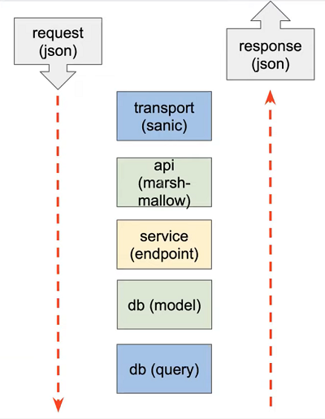

# Messenger

Проект, сделанный во время обучения NapoleonITSchool [(Python BackEnd Developer Course)](https://backend.napoleonit.ru)

## Task

Разработка BackEnd части для оффлайн мессенджера. Предполагается, что пользователь может зарегистрироваться, просматривать
свой профиль и профили других людей, а также отправлять сообщения другим пользователям, зная их логины. Все сообщения 
хранятся в базе данных. Оповещение о новых сообщениях для пользователя не требуется, пользователь
сам запрашивает данные по API.

## Стек технологий

- **Sanic** - в качестве веб-сервера
- **marshmallow** - для валидации данных
- **PostgreSQL** - база данных
- **SQLAlchemy** - ORM
- **Alembic** - для создания миграций

## Использование
Перед запуском приложения необходимо в корневой директории создать файл `.env` и поместить туда следующие элементы:
    
    POSTGRES_DB = <название_для_DB>
    POSTGRES_USER = <имя_пользователя>
    POSTGRES_PASSWORD = <пароль>
    POSTGRES_HOST = <имя_хоста>
    POSTGRES_PORT = <порт>

    host = 0.0.0.0
    secret_token = <your_super_secret_token>

Поле `secret_token` является **обязательным** для заполнения. Поле `host` является **обязательным**, если вы собираетесь запускать
приложение с помощью **docker**. Все остальные поля можно не задавать - в таком случае они будут
заданы по умолчанию.

Для начала работы необходимо склонировать репозиторий к себе на компьютер:

    git clone https://github.com/hyperman98/NapoleonITPython

Далее, запускаем приложение при помощи docker-compose:
    
    docker-compose up

## Описание API
### Создание пользователя
**Примечание:** логин должен быть не меньше 5 символов. Пароль должен быть не меньше
6 символов и не больше 20, иметь хотя бы 1 цифру, минимум одну маленькую и одну заглавную букву.

    /user "POST"
        request: {
            "login": str,
            "password": str,
            "first_name": str,
            "last_name": str
        }
        response: {
            "id": int,
            "login": str,
            "first_name": str,
            "last_name": str,
            "created_at": str,
            "updated_at": str,
            "sent_message": int,
            "received_messages": int
        }

### Аутентификация пользователя
Перед использованием методов, где нужна аутентификация, пользователю необходимо ее пройти.

    /auth "POST"
        request: {
            "login": str,
            "password": str
        }
        response: {
            "Authorization": str
        }

### Получение информации о пользователе
Доступно только для своего пользователя.

    /user "GET"
        request: {}
        response: {
            "id": str,
            "login": str,
            "first_name": str,
            "last_name": str,
            "created_at": str,
            "updated_at": str,
            "sent_message": int,
            "received_messages": int
        }

### Изменение информации о пользователе
Доступно только для своего пользователя.

    /user/<user_id:int> "PATCH"
        request: {
            "first_name": str?,
            "last_name": str?
        }
        response: {
            "id": str,
            "login": str,
            "first_name": str,
            "last_name": str,
            "created_at": str,
            "updated_at": str 
            "sent_message": int,
            "received_messages": int
        }

### Удаление пользователя
Доступно только для своего пользователя.

    /user/<user_id:int> "DELETE"
        Request: {}
        Response: {}

### Создание сообщения
Доступно только для авторизированного пользователя. Пользователь отправляет сообщение **message** 
пользователю с ником **login**.

    /message "POST"
        request: {
            "message": str,
            "login": str
        }
        response: {
            "id": int,
            "sender_id": int,
            "recipient_id": int,
            "created_at": str,
            "updated_at": str,
            "message": str,
        }

### Получение сообщений
Доступно только для авторизированного пользователя.

    /message "GET"
        request: {}
        response: {
            "messages": [
                        {
                            "id": int,
                            "sender_id": int,
                            "recipient_id": int,
                            "created_at": str,
                            "updated_at": str,
                            "message": str,
                            "is_read": boolean
                    },
                    {...},
                ]
        }

### Редактирование сообщений
Доступно только для своих сообщений.
    
    /message/<message_id:int> "PATCH"
        request: {
            "message": str
        }
        response: {
            "id": int,
            "sender_id": int,
            "recipient_id": int,
            "created_at": str,
            "updated_at": str,
            "message": str
        }

### Удаление сообщений
Доступно только для своих сообщений.
    
    /message/<message_id:int> "DELETE"
        request: {}
        response: {}

### Чтение сообщений
Доступно только для своих сообщений.
    
    /message/<message_id:int> "GET"
        request: {}
        response: {
            "id": int,
            "sender_id": int,
            "recipient_id": int,
            "created_at": str,
            "updated_at": str,
            "message": str,
            "is_read": boolean
        }

## Дополнительные методы
### Поиск пользователя с определенным логином

    /user_by_login "GET"
        request: {
            "user_login": str
        }
        response: {
            "created_at": str,
            "total_messages": int
            "sent_message": int,
            "received_messages": int
        }

### Изменение пароля пользователя
Доступно только авторизированному пользователю.

    /user/change_password/<user_id:int> "PATCH"
        request: {
            "password": str,
        }
        response: {
            "message_status": str,
            "status": int
        }

### Изменение логина пользователя
Доступно только авторизированному пользователю.

    /user/change_login/<user_id:int> "PATCH"
        request: {
            "login": str,
        }
        response: {
            "message_status": str,
            "status": int
        }

### Восстановление удаленного пользователя
Доступно только для авторизованного пользователя и пока действует токен.

    /user/restore/<login:string> "PATCH"
        request: {
            "login": str
        }
        response: {
            "id": int,
            "login": str,
            "first_name": str,
            "last_name": str,
            "created_at": str,
            "updated_at": str,
            "sent_message": int,
            "received_messages": int
        }

## Чистая архитектура
Приложение спроектировано на основе идеи чистой архитектуры, которая заключается в том, что код разделяется на слои так, чтобы эти слои минимально зависили друг от друга и было легкозаменяемыми. 

### Идея чистой архитектуры
1. **Независимость от фреймворка.** Архитектура не зависит от существования какой-либо библиотеки. Это позволяет использовать фреймворк в качестве инструмента, вместо того, чтобы втискивать свою систему в рамки его ограничений.
2. **Тестируемость.** Бизнес-правила могут быть протестированы без пользовательского интерфейса, базы данных, веб-сервера или любого другого внешнего компонента. 
3. **Независимость от UI.** Пользовательский интерфейс можно легко изменить, не изменяя остальную систему. Например, веб-интерфейс может быть заменен на консольный без изменения бизнес-правил.
4. **Независимость от базы данных.** Вы можете поменять Oracle или SQL Server на MongoDB, BigTable, CouchDB или что-либо еще. Ваши бизнес-правила не связаны с базой данных.
5. **Независимость от какого-либо внешнего ресурса.** По факту ваши бизнес-правила просто ничего не знают о внешнем мире.

## Схема запросов

## Programmer
Artyom Valiakhmetov - xhuman80@gmail.com (telegram: [art5980](https://t.me/art5980))
